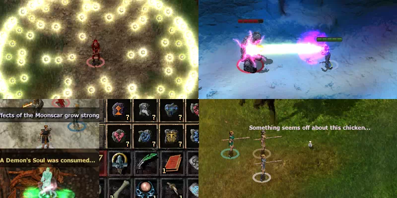

# The Workshop Kitpack / Les Kits de l'Atelier

Téléchargement : https://github.com/D2-mods/The-Workshop-Kitpack/releases  
Forum : [Beamdog](https://forums.beamdog.com/discussion/86749/mod-the-workshop-kitpack), [Gibberlings3](https://www.gibberlings3.net/forums/topic/36122-the-workshop-kitpack/)
Langages: English, French (JohnBob)

--

C'est un pack de Kits sur lequel je travaille depuis un moment. Il comporte actuellement 17 kits + 11 déclinaisons pour multi-classes. Il contient également plus de 30 objets, dont 6 insignes de Chasseur, 12 Runes de Caryll et 17 autres objets divers. Fortement inspiré par les jeux Soulsborne de FromSoft et probablement d'autres sources. Ce mod est compatible avec BG:EE, BG2:EE, IWD:EE et EET.

NOTE : Les tables de capacités pour ces kits sont créées au moment de l'installation. Chaque kit clone la table de la classe de base (si elle existe). Cela signifie que toute modification de classe installée au préalable sera incluse dans les kits du mod.

--

Kit Updater : Utiliser ce composant après tous les mods de tweak et autres overhauls (une possible exeption pour le mod Dual to Kit).
Il reconstruit les tables des HLA, met à jour les compétences d'armes et effectue quelques vérifications mineures. 
Il inclut également l'ancien composant "Mettre à jour la description de la capacité « Chirurgie »" (à utiliser si « Arme empoisonnée » ou « Imposition des mains » ont été révisés après l'installation du Workshop Kitpack).
Plus d'infos dans la section Composants.

--

--

Contenu du mod :
-

#### [Kits de combattants](https://github.com/D2-mods/The-Workshop-Kitpack/blob/main/README.French.md#descriptions-des-kits-)

- Chasseur (Guerrier)
- Limier (Guerrier)
- Protecteur de sépultures (Rôdeur)
- Chevalier au clair de lune (Rôdeur)
- Exécuteur (Paladin)
- Champion du temple (Paladin)

#### [Autres kits](https://github.com/D2-mods/The-Workshop-Kitpack/blob/main/README.French.md#descriptions-des-kits-)

- Mage de bataille (Mage)
- Vagabond des étoiles (Ensorceleur)
- Ecclésiaste sanglant (Clerc)
- Prédateur (Voleur)
- Chantre de la poudre (barde)

#### [v3.0 kits](https://github.com/D2-mods/The-Workshop-Kitpack/blob/main/README.French.md#descriptions-des-kits-)
- Vagabond (rôdeur)
- Chirurgien (moine)
- Seigneur Scion (paladin)

#### [v4.0 kits](https://github.com/D2-mods/The-Workshop-Kitpack/blob/main/README.French.md#descriptions-des-kits-)
- Full Metal Jaguar (Guerrier)
- Urgentiste (Voleur)
- Dégaineur de sortilège (Guerrier / Mage)

#### Kits Multi-classes

- Chasseur (Guerrier / Mage), (Guerrier / Mage / Clerc), (Guerrier / Clerc)
- Limier (Guerrier / Mage)
- Chevalier au clair de lune (Clerc / Rôdeur)
- Prédateur (Guerrier / Voleur), (Guerrier / Mage / Voleur), (Mage / Voleur)
- Full Metal Jaguar (Guerrier / Voleur), (Guerrier / Mage)
- Urgentiste (Mage / Voleur)

#### Objets Divers
  
- 6 [Insignes de Chasseur](https://github.com/D2-mods/The-Workshop-Kitpack/blob/main/README.French.md#insignes-de-chasseur) &emsp;-&emsp;&emsp; peuvent être fabriqués (voir ci-dessous), ou achetés
- 8 [Nouveaux sorts](https://github.com/D2-mods/The-Workshop-Kitpack/blob/main/README.French.md#sorts-du-vagabond-des-%C3%A9toiles-) &emsp;&emsp;&emsp;-&emsp;&emsp; pour le kit du Vagabond des étoiles 
- 12 [Runes de Caryll](https://github.com/D2-mods/The-Workshop-Kitpack/blob/main/README.French.md#les-runes-de-caryll) &emsp;&emsp;-&emsp;&emsp; des objets ayant des effets sur l'ensemble du groupe
- 17 [Autres objets](https://github.com/D2-mods/The-Workshop-Kitpack/blob/main/README.French.md#objets-divers-) &emsp; &emsp;-&emsp;&emsp; tous des objets utilitaires, pas d'armes ni d'armures
- [v3.3+ items](https://github.com/D2-mods/The-Workshop-Kitpack/blob/main/README.French.md#v33-items-)

Composants :

1. The Workshop Kitpack // Les Kits de l'Atelier
	- Option 1: Kits de base + Kits Multi-classes
	- Option 2: Uniquements les Kits de base
	- Option 3: Pack d'objets divers (Pas de kits ou d'insignes de chasseur)
2. Pack d'objets divers
	- Option 1: Installation standard
	- Option 2: Dev mode (commencer le jeu avec un sac d'objets)
3. Patches supplémentaire
	- Kit Updater (corrections ou mise à jour, voir ci-dessous)

--

**Informations supplémentaires :**
- Si l'option 1 ou 2 est installée, Alors le composant "Pack d'objets divers" sera proposé séparément.
- Si l'option 3 est installée, les autres composants seront sautés.
- Les insignes de chasseur sont installées en combinaison avec le kit de Chasseur.

**Kit Updater:**
- Reconstruire les tables des HLA, mettre à jour les compétences d'armes, vérifications mineures, mods compatibilité, etc.
- Non utilisé lors de l'installation initiale du mod, peut être installé / réinstallé à tout moment (ne désinstalle pas les autres mods).
- Utiliser ce composant après tous les mods de tweak et autres overhauls (revisions), y compris les mods qui indiquent devoir être installés en dernier.
- Dual to Kit note: Utiliser ce composant une fois avant Dual to Kit si vous utilisez un mod altérant les compétences d'armes.
Il peut être relancé après si vous avez besoin de mettre à jour d'autres choses plus tard. (note : C'est spécifiquement le composant 3 de Dual to Kit qui doit être exécuté après toute modification des compétences d'armes)

**Configuration (config.ini) :**
- Définir un kit = 0 pour éviter de l'installer
- Désactiver une classe unique désactive également les variants multi-classes.
- Il existe plusieurs autres options. Elles doivent être configurées avant l'installation du mod.
- Certaines options peuvent désormais être modifiées à l'aide de Kit Updater (elles sont clairement indiquées dans config.ini).

--

Descriptions des Kits :
-

  
Kits de combattants :

---

**Chasseur (Guerrier)**

CHASSEUR : Quand il y a des bêtes, il y a des chasseurs. Ceux-ci peuvent être des gardiens, des protecteurs ou bien des mercenaires et des bouchers excités par le sang et les massacres. Cette classe est tout particulièrement apte à combattre de multiples monstres et autres créatures puissantes, notamment les démons et les loups-garous.

Avantages :
- Bonus de 3 aux jets d'attaque et de dégâts contre les lycanthropes et les démons.
- 2ème niveau : Peut utiliser la capacité « Techniques de chasseur » une fois par jour, puis une fois supplémentaire tous les 4 niveaux.

TECHNIQUES DE CHASSEUR : Pendant 12 rounds, les attaques de mêlée du Chasseur infligent 1d3 dégâts d'acide supplémentaires, il bénéficie aussi d'un bonus de 1 à la chance et aux jets de sauvegarde. Cette capacité peut être améliorée en équipant des insignes spécifiquement destinés au Chasseur.

- 5ème niveau : Peut utiliser la capacité « Projectile d'argent » une fois par jour, puis une fois supplémentaire au niveaux 9 et 13.

PROJECTILE D'ARGENT : Pendant 6 rounds toutes les attaques à distance sont amplifiées, infligeant 2 points de dégâts perforants supplémentaires, elles bénéficient également de 5 % de chances de réaliser un coup critique. Tous les types de munitions (flèches, carreaux et billes) sont également enchantés, devenant ainsi capables de toucher les ennemis nécessitant des armes magiques ou en argent.

- 8ème niveau : Bonus de 2 à la classe d'armure et aux jets de sauvegarde contre les lycanthropes et les démons.

- 16ème niveau : La capacité « Projectile d'argent » offre 5 % de chances supplémentaires de réaliser un coup critique et les projectiles sont considérés comme +4.

Inconvénients : 
- Ne peut pas porter d'armure plus lourde que la besantine.
  
---

**Limier (Guerrier**

LIMIER : Les Limiers sont des soldats cuirassés spécialisés dans les combats à distance. Ils sont souvent membres d'escadrons d'élite, submergeant les armées ennemies avec un déluge de projectiles.

Avantages :
- Bonus de 1 à la classe d'armure contre les projectiles au niveau 1 et un bonus supplémentaire tout les 4 niveaux.
- Bonus de 1 aux jets d'attaque et de dégâts avec les armes à distance au niveau 3, puis une fois supplémentaire tous les 5 niveaux.
- Peut atteindre la grande maîtrise (5 points de compétence) avec les arcs long, les arcs courts, les arbalètes, les frondes et les fléchettes.
- Peut utiliser les capacités « Onde de choc » et « Incinération » au niveau 4, puis une fois supplémentaire tous les 4 niveaux, jusqu'à un maximum de 5 au niveau 20

ONDE DE CHOC : La prochaine attaque à distance réussie provoque une vague d'énergie. Toutes les créatures situées dans un rayon de 4,5 m subissent 2d4 + 3 points de dégâts contondants et sont projetées en arrière sur une distance considérable, sans jet de sauvegarde possible. La déflagration inflige 2d4 + 3 points de dégâts contondants supplémentaires par tranche de 4 niveaux, jusqu'à un maximum de 10d4 + 3 points de dégâts au niveau 20.

INCINÉRATION : La prochaine attaque à distance réussie s'étend telle une nuée ardente, recouvrant un rayon de 4,5 mètres. Toutes les créatures présentes dans le nuage subissent 1d6 points de dégâts de feu à chaque round pendant 4 rounds (un jet de sauvegarde contre les souffles réduit les dégâts de moitié). Les dégâts par round augmentent de 1d6 points par tranche de 4 niveaux, jusqu'à un maximum de 5d6 points de dégâts au niveau 20.

Inconvénients : 
- Ne peut se spécialiser avec les armes de mêlés.
- Ne peut se spécialiser dans aucun des styles de combat.

---

**Protecteur de sépultures (Rôdeur)**

PROTECTEUR DE SÉPULTURES : Loin à l'est, les Protecteur de sépultures veillent sur les tombes et le sommeil des morts, s'assurant qu'ils reposent en paix. Ils sont des gardiens, des guides et des conteurs, et possèdent la faculté de renier la mort.

Avantages :
- Bonus de 4 aux jets de sauvegarde contre la paralysie, la mort et les poisons.
- Bonus de 10 au score de connaissances tout les 4 niveaux.
- Peut lancer trois sort profane à la manière d'un prêtre :  
	- 1er niveau : « Orbe chromatique ».  
	- 2ème niveau : « Horreur ».  
	- 3ème niveau : « Piège à crânes ».
 
- 3ème niveau : Immunité à la peur et à la perte de moral. 
- 5ème niveau : Peut utiliser la capacité « Dénégation » une fois par jour, puis une fois supplémentaire tous les 5 niveaux.

DÉNÉGATION : Ce sort a deux effets. Tout d'abord, la cible devient immunisé, pendant 3 tours, à toutes les formes de mort magique. 
Si celle-ci voit ses points de vie tomber en dessous des 50 %, un deuxième effet s'activera et lui redonnera toute sa santé, consumant le sort au cours du processus.

- 8ème niveau : Immunité à l'aveuglement et aux attaques de regard.

Inconvénients : 
- Ne peut pas porter d'armure plus lourde que la cotte de mailles.
- Ne peut utiliser la capacité « Charme-animal ».
- Ne peut pas être d'alignement mauvais ou chaotique.

---

**Chevalier au clair de lune (Rôdeur)**

CHEVALIER AU CLAIR DE LUNE : Ces chevaliers errants, marqués d'une cicatrice pour avoir bravé l'interdit et rêvé d'une lune éternelle, se rendent en pèlerinage à la recherche d'autels éclairés par la lune, en quête d'une illumination sur les mystères de l'invisible.

Avantages :
- Balafré par la lune : Bonus de 1 aux jets de sauvegarde, passe à 2 au niveau 8 et à 3 au niveau 16 et à 3 au niveau 10.

- 2ème niveau : Gagne la capacité passive « Cascade ».

CASCADE : Une attaque réussie octroie au personnage 10 % de chances de bénéficier des effets de la hâte pendant 10 secondes, gagnant une attaque supplémentaire par round et doublant sa vitesse de déplacement.
Au niveau 8, les attaques infligent 2 points de dégâts magiques supplémentaires.
au niveau 16, le nombre d'attaques par round est doublé.
Les effets de « Balafré par la lune » sont inversés quand cette capacité est activée.

- 7ème niveau : Peut utiliser la capacité « Albédo » une fois par jour, puis une fois supplémentaire tous les 4 niveaux.

ALBÉDO : Libère un rayonnement lunaire dévastateur qui s'étend jusqu'à la zone ciblée, infligeant sur son passage 8d10 points de dégâts magiques aux ennemis. Les morts-vivants et les créatures extra-planaires subissent le double des dégâts. De plus, la lumière rémanente issue de l'incantation confère au personnage un bonus de 20 % de résistance magique, pendant 4 rounds.

- Peut être de n'importe quel alignement.
- Ne peut être déchu en raison de sa réputation.

Inconvénients :
- Balafré par la lune : Pénalité de 1 à la classe d'armure contre les attaques tranchantes, perforantes et les projectiles. Cette pénalité passe à 2 au niveau 8 et 3 au niveau 16.
- Ne peut se spécialiser avec les armes à distance.
- Ne peut pas utiliser la Furtivité.

---

**Exécuteur (Paladin)**

EXÉCUTEUR : L'Exécuteur est un paladin qui œuvre pour son église. Il est doué d'une grande variété de compétences, rechercher des informations, dévoiler les mensonges et traquer les ennemis de l'église ne sont que quelques unes des tâches qui lui sont confiées.

Avantages :
- Peut lancer quatre sort profane à la manière d'un prêtre :  
	- 1er niveau : « Cécité ».  
	- 2ème niveau : « Flou ».  
	- 3ème niveau : « Toucher vampirique ».  
	- 4ème niveau : « Mot secret ».

- 2ème niveau : Peut utiliser la capacité « Empalement » une fois par jour, puis une fois supplémentaire tous les 4 niveaux.

EMPALEMENT : La prochaine attaque à distance réussie enchevêtre la cible pendant 3 rounds, plus 3 rounds supplémentaires en cas d'échec du jet de sauvegarde contre les sorts. Une créature enchevêtrée a toujours la possibilité d'attaquer, mais elle subit une pénalité de 2 à sa classe d'armure et a 20 % de chances d'échouer l'incantation de ses sorts.

- 5ème niveau : Peut utiliser la capacité « Évangile sanguinolente » une fois par jour, puis une fois supplémentaire au niveaux 9 et 13.

ÉVANGILE SANGUINOLENTE : Pendant 5 rounds, le personnage récupère 1d4 points de vie à chaque attaque de mêlée réussie et provoque une hémorragie à sa cible, lui infligeant 2 point de dégâts par round pendant 6 rounds (sans jet de sauvegarde possible). Une même créature peut être blessée une fois par round et les effets sont cumulatifs.

Inconvénients : 
- Ne peut pas porter d'armure plus lourde que la besantine.
- Ne peut utiliser « Imposition des mains »

---

**Champion du temple (Paladin)**

CHAMPION DU TEMPLE : Ces chevaliers en armure lourde sont principalement présents près des temples et des églises de Toril, protégeant ces lieux sacrés. Ce sont des soldats vertueux, qui se dressent avec détermination contre tout adversaire.

Avantages :
- Peut atteindre la haute maîtrise (4 points de compétence) avec les armes d'hast et les armes contondantes.
- Peut utiliser la capacité « Imposition des mains » trois fois par jour.
- 2ème niveau : Peut utiliser la capacité « Force » une fois par jour, puis une fois supplémentaire tous les 4 niveaux.

FORCE : Produit une onde de choc qui n'inflige aucun dégât, mais étourdit les ennemis à proximité. Tous les adversaires présents dans un rayon de 4,5 mètres sont propulsés en arrière et étourdis pendant 4 secondes (sans jet de sauvegarde possible). Les créatures gigantesques ne seront pas projetées mais étourdies un court instant.

- 9ème niveau : Peut utiliser la capacité « Rayon divin » une fois par jour, puis une fois supplémentaire au niveaux 13 et 17.

Inconvénients : 
- Ne peut pas se spécialiser avec les armes à projectiles.
- Sa capacité à repousser les morts-vivants est deux point inférieur à celle des autres paladins et ne devient effective qu'au niveau 5.

---

  
Autres kits :

---

**Mage de bataille (Mage)**

MAGE DE BATAILLE : Le Mage de bataille apprend à puiser dans ses capacités magiques naturelles et à les amplifier, lui permettant ainsi d'acquérir des aptitudes supérieures à celles d'un magicien ordinaire, bien que ce processus soit physiquement très éprouvant.

Avantages :
- Bénéficie de 10 % de résistance contre les dégâts de feu, de froid, d’électricité, d'acide et magique. Gagne 5 % supplémentaires tous les 5 niveaux, jusqu'à un maximum de 30 % au niveau 20.
- Peut utiliser les capacités « Déchaînement de magie » et « Barricade », Gagne une utilisation supplémentaire au niveau 2, puis tous les 4 niveaux.

DÉCHAÎNEMENT DE MAGIE : Le lanceur de sorts renverse les énergies élémentaires. Pendant 4 rounds, chaque bonus devient une pénalité de 10 % et le lanceur gagne 10 % à tous les dégâts de feu, de froid, d'électricité, d'acide et de magie qu'il inflige ainsi qu'un bonus de 2 au niveau de lanceur de sort. Ces bonus et pénalités augmentent au même rythme que la résistance naturelle du Mage de bataille.

BARRICADE : Pendant 4 rounds, tous ses bonus de résistance sont triplés et tous les projectiles normaux sont déviés. Pendant la durée du sort, les mouvement du personnage sont ralentis de moitié. À partir du niveau 10 tous les sortilèges à destination du personnage seront déviés, sauf pour les sorts effectifs sur une zone.

Inconvénients :
- Pénalité de 2 en Force et en Constitution.

---

**Vagabond des étoiles (Ensorceleur)**

VAGABOND DES ÉTOILES : Les Vagabonds des étoiles sont des nomades venus de par delà les étoiles. Ils ont fui un immense fléau sévissant sur leur planète d'origine, et plusieurs d'entre eux se sont retrouvés sur Toril. Ces marginaux ressemblent à de puissants sorciers, mais la destruction de leur foyer, et la dérive qui en a résulté, a eu des répercussions considérables sur leur mental et leur physique.

Avantages :
- Ne peut être affecté par la magie empêchant les incantations, Surdité et Silence
- Accède immédiatement aux sorts de niveau 1 à 8 dédiés au Vagabond des étoiles : « Faille », « Surcharge », « Dipôle », « Pacification », « Défibrillation », « Bombe électrique », « Grog », et « Fissure ».
- 5ème niveau : Peut utiliser la capacité « Interférence » une fois par jour, puis une fois supplémentaire tous les 5 niveaux.

INTERFÉRENCE : Perturbe les attaques de projectiles et les sorts dans la zone d'effet. Tous les ennemis dans un rayon de 9 m subissent une pénalité de 3 aux jets d'attaque avec les armes à distance et leurs sorts ont 25 % de chances d'échouer pendant 1 tour (pas de jet de sauvegarde). Les pénalités augmentent de 1 pour les jets d'attaque et de 5 % pour l'échec des sorts tous les 5 niveaux.

Inconvénients : 
- Pénalité de 2 à la Dextérité et en Sagesse.

---

**Ecclésiaste sanglant (Clerc)**

ECCLÉSIASTE SANGLANT : L'ancienne Église de la Guérison aujourd'hui entaché d'hérésie était le foyer du rétablissement par le sang, un remède dont on prétendait qu'il avait la capacité de guérir n'importe quelle maladie, qu'elle soit d'origine naturelle ou divine. Depuis quelque temps, des prêtres de cette église ont recommencé à apparaître sur la Côte des Épées.

Avantages :
- Immunité au drainage de niveau, aux poisons et aux maladies.
- Peut utiliser la capacité « Injection » une fois par jour à partir du niveau 2, puis une fois supplémentaire tous les 2 niveaux pour un maximum de 10 au niveau 20. Lorsque cette capacité est activée, elle permet d'utiliser plusieurs type de transfusions. De nouvelles transfusions sont disponibles en fonction du niveau :  
  2ème niveau : « Guérison par le sang ».  
  6ème niveau : « Sang de la Bête ».  
  10ème niveau : « Sang du lunatique ».  
  14ème niveau : « Élixir sanglant ».

GUÉRISON PAR LE SANG : Du sang prélevé sur une des sœurs de l'Église de la Guérison restaure 15 % des points de vie maximum et régénère miraculeusement 2 points de vie par round pendant 3 tours. Dans ce laps de temps, le bénéficiaire subit une pénalité de 1 aux jets d'attaque. Ce sang guérit également les empoisonnements et les maladies.

SANG DE LA BÊTE : Administrez ce sang confère temporairement les aptitudes d'une bête. Pendant 3 tours la cible bénéficie d'un bonus de 1 aux dégâts et elle reçoit un bonus de 1 supplémentaire pendant 2 rounds pour chaque attaque réussie, mais subit une pénalité de 3 à la classe d'armure. Ce sang protège également contre les poisons et les maladies.

SANG DU LUNATIQUE : Cette injection donne un léger aperçu du cosmos et de ses mystères. La cible bénéficie d'un bonus de 4 à l'intelligence et à la sagesse, 5 % de résistance supplémentaire à la magie et un bonus de 1 à la vitesse d'incantation, mais elle subit aussi une pénalité de 1 à tous ses jets de sauvegarde. Les effets durent 3 tours. Ce sang restaure également les niveaux perdus.

ÉLIXIR SANGLANT : Une décoction mystérieuse qui améliore considérablement la résistance au détriment d'autres capacités. Le destinataire voit sa résistance à tous les dégâts physiques augmentée de 20 % et bénéficie d'un bonus de 4 à sa classe d'armure et ses jets de sauvegarde, mais subit aussi une pénalité de 1 à la chance. Les effets durent 3 tours. Ce sang prévient également le drainage de niveau.

Inconvénients : 
- Ne peut porter de gantelets ou de bracelets magiques.

---

**Prédateur (Voleur)**

PRÉDATEUR : Agissant avec célérité et sans aucune pitié pour sa cible. Ce Prédateur de prédateurs est un tueur expérimenté et redouté, mais il n'est pas nécessairement cruel ou maléfique, malgré le caractère déplaisant de son travail.

Avantages :
- Bonus de 1 aux jets d'attaque et de dégâts contre les humains, les demi-humains, et autres races humanoïdes de petites taille. Ce bonus passe à 2 au niveau 5 et à 3 au niveau 10.
- 4ème niveau : Peut utiliser la capacité « Tir éclatant » une fois par jour, puis une fois supplémentaire tous les 4 niveaux.

TIR ÉCLATANT : Pendant 3 rounds, chaque attaque à distance réussie génère de multiples éclats tranchants. Tous les ennemis dans un rayon de 4,5 m subissent 2 points de dégâts perforants et souffrent d'hémorragie, ce qui leur inflige 1 point de dégâts supplémentaires par round pendant 1 tour (pas de jet de sauvegarde). Une même cible peut être blessée une fois par round et les effets sont cumulatifs.

- 9ème niveau : Peut utiliser la capacité « Instinct » une fois par jour, puis une fois supplémentaire au niveaux 13 et 17.

INSTINCT : La prochaine attaque de mêlée, dans un délai d'un round, a 100 % de chances de réussir un coup critique. Cette capacité restaure également 5 + 20 % du maximum de points de vie à l'utilisateur et le place sous l'effet de la hâte pendant 10 secondes.

Inconvénients : 
- Ne dispose que de 20 points par niveau pour les talents de voleur.
- Ne peut pas poser de pièges.

---

**Chantre de la poudre (barde)**

CHANTRE DE LA POUDRE : Les Chantres de la poudre sont une faction de bardes, connus pour leur amour des armes mécaniques complexes et des grosses explosions. Leurs instruments font office de dispositifs incendiaires et peuvent provoquer une variété d'effets explosifs.

Avantages :
- Bénéficie de 10 % de résistance au feu, ce bonus augmente de 10 % tous les 5 niveaux jusqu'à un maximum de 50 % au niveau 20.
- Accède à un chant du barde spécifique au Chantre de la poudre. Les chansons peuvent être sélectionnées à partir du menu des capacités spéciales. De nouvelles chansons sont disponibles en fonction du niveau :
  1er niveau : « Chant enflammé ».
  5ème niveau : « Son détonant ».
  10ème niveau : « Déflagration de poussière ».
  15ème niveau : « Flamme frénétique ».

CHANT ENFLAMMÉ : Un cercle de flammes se propage sur un rayon de 4,5 m, infligeant 1d4 points de dégâts de feu par niveau du personnage, jusqu'à un maximum de 20d4 au niveau 20, toute créature se trouvant dans la zone d'effet doit réussir un jet de sauvegarde contre les souffles pour réduire les dégâts de moitié. Seule la personne qui joue la chanson est à l'abri des flammes. La pyrotechnie utilisée pour amorcer le « Chant enflammé » inflige 2 points de dégâts de feu supplémentaires aux ennemis dans un rayon de 3,5 m.

SON DÉTONANT : Une vague massive se propage sur un rayon de 4,5 m, infligeant 3d8 points de dégâts contondants aux ennemis qui se retrouve sous l'effet de la surdité pendant 4 rounds, un jet de sauvegarde contre les sorts réduit ce temps de moitié. La surdité entraîne une probabilité d’échec de l'incantation des sorts de 50 %.

DÉFLAGRATION DE POUSSIÈRE : La première déflagration inflige 8d6 points de dégâts de feu à tous les ennemis dans un rayon de 4,5 m (un jet de sauvegarde contre les souffles réduit les dégâts de moitié). Le nuage de poussière et la fumée que dégage l'explosion persiste pendant 3 rounds et s'étant sur une surface de 6 mètres de rayon. Toutes les créatures présentes dans le nuage sont aveuglées sans jet de sauvegarde possible, mais elles sont aussi dissimulées par la fumée et ne peuvent être directement visées, à moins d'avoir les moyens de percevoir ce qui est invisible. Les ennemis voient leur mouvements réduits de moitié.

FLAMME FRÉNÉTIQUE : Cette attaque répand une flamme vivante qui enveloppe un rayon de 6 m et persiste pendant 2 rounds. Tout ennemi pénétrant dans les flammes subit immédiatement les effets du sommeil, de la confusion, de la peur ou de la folie du berserker pendant 5 rounds (25 % de chances d'être affecté par chacun). Les ennemis subissent également 2d12 points de dégâts magiques par round tant qu'ils se trouvent dans la zone. Il n'y a pas de jet de sauvegarde, mais la résistance à la magie peut contrecarrer les effets.

- Si la capacité de haut niveau « Chant du barde amélioré » est acquise, le personnage disposera d'une capacité lui permettant de basculer sur cette chanson.

Inconvénients : 
- Le chant du barde est désactivé pendant 8 rounds après utilisation.
- N'obtient qu'un quart du score de Vol à la tire.

---

  
v3.0 kits:

---

**Vagabond (Rôdeur)**

VAGABOND : Le Vagabond erre sans attache ni dessein dans les contrées les plus inhospitalières. Ses remarquables aptitudes au combat ont été affûté par d'innombrables batailles.

Avantages :
- Bonus de 4 aux jets de sauvegarde contre les souffles.
- Bonus de 1 à la classe d'armure, bénéficie d'un bonus supplémentaire de 1 tous les 5 niveaux.
- Bonus de 1 aux jets d'attaque et de dégâts au niveau 3, puis une fois supplémentaire tous les 5 niveaux.
- Ne sera pas déchu en raison de la réputation.
- Vitesse de déplacement augmentée de 2.
- 6ème niveau : Immunité à « Glisse », « Toile d'araignée », « Enchevêtrement », « Croissance d'épines », et « Pierres acérées ».
- 7ème niveau : Gagne la capacité passive « Évasion ». **
- 12ème niveau : Immunité à « Nuage mortel », « Brume mortelle », « Nuage puant », « Brouillard putride », et « Nuage de pestilence ».

Inconvénients :
- N'a pas accès aux sorts de prêtre.
- Ne peut pas porter d'armure plus lourde que l'armure de cuir ou l'armure de peau.
- Ne peut pas être d'alignement loyal.

** Remarque : Évasion peut être obtenue dans IWD:EE, si le mod IWDification est installé ou le mod Talents of Faerûn.

**Chirurgien (Moine)**

CHIRURGIEN : Le Chirurgien est un combattant disposant d'une connaissance approfondie en médecine. Il a bénéficié d'un entraînement spécifique lui conférant la capacité de concocter de puissants remèdes à base de plantes pour renforcer ses alliés au cours des combats.

Avantages :
- Peut utiliser l'énergie mystique afin d'activer ses capacités spéciales, le chirurgien obtient 1 point tout les 2 niveaux à partir du niveau 1.
- Régénération mystique : Cette capacité passive permet au chirurgien de récupérer 1 point d'énergie mystique tout les 5 rounds.
- Peut utiliser la capacité « Sombre Remède », nécessite 1 point d’énergie mystique.

SOMBRE REMÈDE : Toutes les attaques effectuées dans les 10 prochaines secondes diffusent un remède curatif qui restaure 2d6 points de vie à tous les alliés dans un rayon de 2,1 mètres.

- 5ème niveau : Peut utiliser la capacité « Remède Vital », nécessite 2 points d’énergie mystique.

REMÈDE VITAL : Toutes les attaques effectuées dans les 10 prochaines secondes diffusent un remède apaisant. Tous les ennemis présents dans un rayon de 2,1 m sont ralentis durant 1 round, et doivent effectuer un jet de sauvegarde contre la mort ou s'endormir pendant 5 rounds, à moins d'être attaqués dans leur sommeil.

- 7ème niveau : Peut utiliser la capacité « Chirurgie », nécessite 3 points d’énergie mystique.

CHIRURGIE : Cette capacité permet de sélectionner un des traitements chirurgicaux suivants, les actions curatives sont appliquées instantanément à la créature ciblées : 
- « Imposition des mains »
- « Saignée »
- « Appel de l'esprit »
- « Ablation Spirituelle »
- « Arme empoisonnée »

- 9ème niveau : Peut utiliser la capacité « Déluge Salvateur », nécessite 4 points d’énergie mystique.

DÉLUGE SALVATEUR : Des éclats cristallins bénéfiques déferlent dans un rayon de 3,6 mètres, pendant 2 rounds. Balayant la fatigue et soignant à hauteur de 15 % + 10 du total de points de vie à chaque round de toutes les créatures alliés ou neutres présentes dans la zone.

- 13ème niveau : Peut utiliser la capacité « Pestilence du dragon », nécessite 5 points d’énergie mystique.

PESTILENCE DU DRAGON : Un dragon onirique éructe un souffle fétide, tous les ennemis dans un rayon de 4,5 m sont affectés par sa pestilence et subissent des dégâts, 5 % + 8 du total de points de vie par round pendant 5 rounds sans jet de sauvegarde possible. Les victimes reçoivent aussi un malus de 4 à leurs jets de sauvegarde pour la durée du sort.

Inconvénients :
- Ne dispose que de 8 points par niveau pour les talents de voleur.
- Ne peut utiliser « Paume vibratoire ».
- Ne peut utiliser « Coup étourdissant ».

**Seigneur Scion (Paladin)**

SEIGNEUR SCION : Descendant d'une lignée honorable, le Seigneur Scion a foi dans son héritage. Ce justicier excelle dans le combat à distance et imprègne ses munitions de sang pour réaliser des tirs dévastateurs.

Avantages :
- Bonus de 1 aux jets d'attaque avec les armes à distance au niveau 1, puis tous les 5 niveaux.
- Peut atteindre la grande maîtrise (5 points de compétence) avec les arcs long, les arcs courts, les arbalètes, les frondes et les fléchettes
- 3ème niveau : Peut utiliser la capacité « Tir saignant » une fois par jour, puis une fois supplémentaire tous les 3 niveaux.

TIR SAIGNANT : Le personnage sacrifie 5 points de vie. Ainsi pendant les 2 rounds suivants, son TAC0 est doublé avec les armes à distance et toutes ses attaques à distance infligent 1d3 points de dégâts perforants supplémentaires par tranche de 3 niveaux du personnage.

- 8ème niveau : +5 % de chance d’effectuer un coup critique avec les armes à distance.
- 16ème niveau : +5 % de chance d’effectuer un coup critique avec les armes à distance.

Inconvénients :
- Ne peut pas porter d'armure plus lourde que l'armure feuilletée.
- Ne peut se spécialiser avec les armes de mêlée.
- Ne peut se spécialiser dans aucun style de combat.

---

  
v4.0 kits:

---

**Full Metal Jaguar (Guerrier)**

FULL METAL JAGUAR : Un grand guerrier aux talents multiples, le Full Metal Jaguar commence par décocher une salve de projectiles sur ses ennemis avant de se jeter dans la bataille et de les terrasser au corps-à-corps.

Avantages :
- Bonus de 1 aux jets d'attaque et de dégâts.
- 3ème niveau : Immunité à l'attaque sournoise.
- 5ème niveau : Peut utiliser la capacité « Fantomatique » une fois par jour, puis une fois supplémentaire tous les 5 niveaux.

FANTOMATIQUE : Cette capacité est effective pendant 5 rounds. À chaque round, 1 image miroir du personnage apparaît, celle-ci absorbera une attaque pendant ce même round. Le nombre d'images passe à 2 par round au niveau 10, à 3 au niveau 15 et enfin à 4 au niveau 20.

- 7ème niveau : Gagne la capacité passive « Décochage critique ».

DÉCOCHAGE CRITIQUE : Les attaques à distance augmentent les chances d'effectuer un coup critique avec les armes de mêlée. Chaque attaque réussie avec une arme à distance confère un bonus cumulatif de 5 % pendant 3 rounds. Un échec critique annule les bonus.

Inconvénients :
- Ne peut porter d'armure plus lourde que l'armure feuilletée.

---

**Urgentiste (Voleur)** (Nurse)

URGENTISTE : Naturellement douée, l'urgentiste est à la fois un alchimiste et un archer, investigation et apprentissage sont ses maîtres mots.

Avantages :
- Bonus de 1 aux jets d'attaque avec les armes à distances tous les 3 niveaux.
- Peut atteindre la spécialisation (2 points de compétence) avec les arcs cours, les arbalètes les frondes et le fléchettes.

- Peut utiliser la capacité « Concoction » une fois par jour au niveau 1 et 6, puis une fois supplémentaire tous les 6 niveaux.

CONCOCTION : Prépare un ensemble de concoctions utilisable comme des capacités spéciales pendant une heure.   
Chacune d'entre elles nécessite un point d'alchimie et l'Urgentiste dispose de 3 points.  
De nouvelles capacités sont disponible à plus haut niveau.  
  1er niveau : Seringues  
  5ème niveau : Adrénaline  
  9ème niveau : Overdose  
  13ème niveau : Intraveineuse  
  17ème niveau : Cocktail  

SERINGUES : Ces fléchettes guériront les alliés et empoisonneront les ennemis. Leur effet curatif ou bien leur toxicité est équivalente à 1d4+3 + 1 point de vie par tranche de 5 niveaux. Les Seringues sont considérées comme des armes magiques +2, et bénéficient d'un bonus de 5 au jets d'attaque. Les points de compétence investis dans les fléchettes par le personnage n'affectent pas les jets d'attaque.

ADRÉNALINE : Prodigue les premiers soins à n'importe quelle créature vivante. Restaure 2 points de vie par niveau, jusqu'à un maximum de 40 points de vie.

OVERDOSE : Pendant 5 rounds, le personnage bénéficie d'une attaque supplémentaire par round, de 3 points de talent par niveau dans les compétences de voleur, de 10 % de chances de coup critique avec les armes à distance et d'une immunité aux sorts : Lenteur, Labyrinthe, Sommeil, Étourdissement et Drain de niveau. Cette capacité ne peut pas être utilisée en combinaison avec les sorts de hâte et hâte améliorée.

INTRAVEINEUSE : La prochaine attaque à distance réussie contraint la cible à effectuer un jet de sauvegarde contre la mort à -2 ou être frappé de Débilité mental pendant 7 rounds. Si le jet de sauvegarde est réussi, la cible sera tout de même sous l'effet de Confusion et Lenteur pendant 2 rounds.

COCKTAIL : Le bénéficiaire ne sera pas affecté par : le poison, le maladie, la paralysie, l'étourdissement, le sommeil, la cécité, la surdité, le charme, la folie du berserker, la peur, la confusion ou la débilité mentale. Cette capacité restaure aussi 30 % du maximum de points de vie de l'utilisateur, dure 3 tours et ne protège qu'une fois.

Inconvénients :
- Ne dispose que de 15 points à répartir dans ses talents de voleur à chaque monté de niveau.
- Ne peut porter d'armure plus lourde que l'armure de cuir.

---

**Dégaineur de sortilège (Guerrier / Mage)** (Spell Fencer)

DÉGAINEUR DE SORTILÈGE : Un expert des duels, le Dégaineur de sortilège allie son expertise des armes à ses talents en magie afin de surpasser son adversaire.

Avantages :
- Bénéficie d'un sort supplémentaire par niveau.
- Bonus de 1 à la classe d'armure, puis une fois supplémentaire tous les 5 niveaux dans la classe de guerrier.
- Bonus de 1 aux jets de sauvegarde contre les sorts tous les 4 niveaux dans la classe de mage, jusqu'à un bonus maximum de 5 au niveau 20.
-  Gagne la capacité passive « Plus vite que son ombre ». Cette capacité nécessite d'avoir atteint le niveau 5 pour ses deux classes, Mage et Guerrier.

PLUS VITE QUE SON OMBRE : À chaque attaque de mêlée réussie, le Dégaineur de sortilège bénéficie d'un bonus cumulatif de 2 à la vitesse d'incantation pendant 10 secondes. Un échec critique annule les bonus.

Inconvénients :
- Ne peut se spécialiser avec les armes à distance.
- Ne peut porter d'armure plus lourde que la cotte de mailles.

---

Compatibilité :
-

**IMPORTANT : Si vous rencontrez un problème avec les kits de magie des arcanes (par exemple le Vagabond des étoiles), qui ne disposeraient pas de la sélection complète de sorts prévu lors de la montée de niveau ou à la création du personnage, une solution de contournement consiste à installer le composant "No Opposition Schools" (Pas d’écoles d'opposition) du mod [Subtled Spell Tweaks](https://github.com/subtledoctor/SubtleD_Spell_Tweaks/releases). Cette modification peut être installée en toute sécurité à la fin de votre installation.**

Informations supplémentaires : En raison de la façon dont le jeu détecte les mages spécialistes, une fois que vous atteignez un nombre suffisamment élevé de kits, tous les kits de mage ajoutés par la suite sont susceptibles de partager des restrictions avec un ou plusieurs mages spécialisés. Cela n'affecte que l'écran de sélection des sorts. Les Mages et les Bardes pourront toujours mémoriser des parchemins. C'est principalement un problème pour les kits d'ensorceleurs. Pour l'instant, la meilleure chose à faire si le problème se pose est d'installer le composant de Subtled Spell Tweaks mentionné ci-dessus.

#### Instructions générales :

- Installer The-Workshop-Kitpack après les mods qui modifient les classes à l’exception du mod Talents of Faerun.
Si un mode indique spécifiquement qu'il doit être installer après n'importe quel kit. Vous pouvez essayer les deux méthodes. (Voir les notes du mod Talents of Faerun ci-dessous)
- Installer après les mods qui ajoutent ou modifient les sorts. (Une possible exception pour le mod OlvynSpells, Voir ci-dessous)
- Installer après les mods qui ajoutent de nouvelles armes ou armures.
- Peut être installé avant ou après les mods qui révisent les compétences martiales. (À l’exception du mod Talents of Faerun)
L'ordre recommandé est de l'installer avant la plupart des mods qui révisent les compétences martiales et d'utiliser le composant Kit updater après.
- Peut être installé avant ou après les mods qui modifient les HLA (capacités de haut niveau). (À l’exception du mod Talents of Faerun).
Toutes les modifications des tables HLA sont effectuées à partir du composant principal et du composant Kit updater. Vous pouvez réinstaller Kit updater à tout moment pour reconstruire toutes les tables HLA.

NOTE : En général, je recommande d'installer ce mod après les autres kits, à l'exception de Talents of Faerun et des mods dédiés aux multiclasses. Techniquement, ce mod peut être installé en toute sécurité même après la plupart des mods de tweak, mais c'est toujours une bonne idée de suivre les directives d'installation habituelles, qui font passer les kits avant les tweaks.

#### Les systèmes de lancement de sorts :

Faiths and Powers :
- Compatible avec le système de sphères de Faiths and Powers. Ils peuvent être installé avant ou après.
- (Après est recommandé.) (Voir ci-dessous pour des informations supplémentaires).

Deities of Faerun :
- Compatible avec le système de sphères de Deities of Faerun. 
- Installez ce mod après Deities of Faerun.

5E_spellcasting :
- Compatible avec le mod 5E_spellcasting de subtledoctor. 
- Installer The Workshop Kitpack avant le mod 5E_spellcasting. 
- Puis utiliser le composant Kit updater après 5E_spellcasting.

Sphere lists: [readme-spheres.txt](d2-workshopkits/readme-spheres.txt)

--

Note sur le mod Talents of Faerun : 
	- Les composants de sorts peuvent être installés avant ou après The Workshop Kitpack, je recommande de les installer avant (en particulier les sorts d'IWD).
	- Les composants liés aux races peuvent être installés avant ou après The Workshop Kitpack.
	- Les composants qui tweak les kits devraient être installés après The Workshop Kitpack (Certains peuvent être installés avant, mais ils sont souvent tous mélangés, il est donc plus simple de tout installer après.)
	- Les kits de lanceurs de sorts divins de The Workshop Kitpack ont un support complet et personnalisées pour le système de sphères. Doivent être installé avant les révisions du clerc de ToF.
	- Tous les kits doivent être installés avant tout ce qui touche aux tables de compétence ou des HLA (sinon les boutons risquent de ne pas fonctionner).

NOTE : La capacité de haut niveau « Évasion » peut être installée avant ou après ce mod. Les kits qui permettent d'en bénéficier l'obtiendront, qu'ils aient été installés avant ou après. Les sorts / capacités qui vérifient la présence d'« Évasion » ne le feront que si la capacité est déjà présente dans le jeu. Si vous souhaitez installer « Évasion » avant ce mod, utilisez plutôt la version du mod IWDification.

Kit Updater: **Est INDISPENSABLE pour une compatibilité totale avec le mod Talents of Faerun.** reconstruit toutes les tables de capacités de haut niveau~ (qui seront probablement endommagés sans cela). Corrections mineures pour les kits Chirurgien et Chantre de la poudrre. (Voir ci-dessous pour des informations supplémentaires sur les capacités / HLA).

--

OlvynSpells notes (testé avec la version 2.6.0):
- Les tweaks / modifications de sorts peuvent être installés avant ou après The Workshop Kitpack. Certains d'entre eux écrasent des fichiers, il est donc préférable de les installer avant.
- Les composants concernant les Paladin / Rôdeurs peuvent être installés avant ou après. Notez que le tweak pour les niveaux de lanceur de sorts doit être installé après la plupart des autres mods ajoutant des kits.
- Les nouveaux sorts peuvent être installés avant ou après. Notez qu'ils doivent doit être installés après la plupart des autres mods ajoutant des kits (OlvynSpells ajoute des sorts directement dans les tables des kits pour certaines classes).
- Le composant 3E-like Metamagic peut être installé (à partir de la version 5.17 du Workshop Kitpack). Confirmation du fonctionnement avec les sorts arcaniques / divins spécifiques aux kits.
("Spell Level Increase" +2 means using it on a level 2 spell expends one level 4 spell instead).
- Les sorts du Vagabond des étoiles sont également compatibles avec le sort Nécropotence de niveau 9, avec ou sans l'option de configuration du fichier spell.ids.
Si The Workshop Kitpack a été installé avant OlvynSpells, lancez le Kit Updater pour vérifier les effets du mod EEex.

NOTE : Avec les versions actuelles des deux mods, tout devrait bien fonctionner, qu'il soit installé avant ou après. Si vous voulez être sûr à 100%, installez les nouveaux sorts après The Workshop Kitpack, car les futures mises à jour pourraient potentiellement ajouter de nouveaux effets EEex.
--

#### Mods ajoutant des capacités ou capacités de haut niveau :

- Les kits qui ont le désavantage de ne pas gagner une capacité de classe ne devraient généralement pas prendre ces capacités en tant que capacités de haut niveau.
- Certains kits peuvent gagner certaines HLA ajoutées par des mods si elles sont détectées. (note : ce mod n'installe pas de HLA, il analyse les tables HLA existantes et copie-colle les lignes si elles sont détectées).
- Le kit de Prédateur peut utiliser les HLA se rapportant aux pièges, y compris ceux ajoutés par des mods (l'ordre d'installation n'a pas d'importance). Il faut simplement être voleur de niveau 14 ou plus.

**Talents of Faerun capacités ou capacités de haut niveau :**

- De nombreux kits obtiennent une ou plusieurs options supplémentaires. (ex. tous les archers peuvent acquérir n'importe quelle HLA en rapport aux attaques à distances, le Chirurgien peut utiliser des améliorations liées au poison, le Protecteur de sépultures peut apprendre utilisation des parchemins ou des baguettes, etc.)
- Certains kits ont des options limitées. (ex. Le Vagabond ne peut bénéficier d'aucune capacité liée aux sorts, mais a accès à plus de capacités de combat que les autres rôdeurs).
- Tous les kits arcaniques de ce mod recevront automatiquement la capacité de haut niveau « Connaissance des arcanes ». Cette capacité est nécessaires pour sélectionner les sorts de haut niveau. La capacité est indiqué au niveau 1, mais ses effets ne se manifestent qu'au niveau 18 du mage.

- NOTE : Le Kit Updater patche le fichier m_dw_hld.lua, et sauvegarde une version non modifiée dans le dossier « weidu_external\d2wk ». Il ne devrait normalement pas être nécessaire de restaurer la sauvegarde, mais juste au cas où, Kit updater a une option pour le faire.

#### Information supplémentaire pour le mod Faiths and Powers : 

- Les kits multi-classés ne nécessite pas le composant FnP Multiclass du mod Faiths and Powers pour être compatible avec Faiths and Powers.
- Il est préférable d'installer The Workshop Kitpack APRÈS avoir installé le système de sphères de Faiths and Powers.
- Cela fonctionnera s'il est installé AVANT, mais certaines sphères pourront être incorrectes.

 Composant FnP Multiclass (Problème connu):
- La version actuelle de FnP multiclass masque la classe G/M/C (Guerrier / Mage / Clerc) de l'écran de sélection à la création du personnage. 
- Il est possible que le mod FnP multiclass soit mis à jour pour ne pas désactiver la Multi-classe (Guerrier / Mage / Clerc), mais pour l'instant, il existe quelques moyens de contourner ce problème :
1. Installez ce mod après FnP multiclass. Il la réactivera automatiquement.
2. Utilisez Cdtweaks/Tweaks Anthology. Il contient des composants qui permettent à toutes les classes (y compris FMC) d'être disponibles pour toutes les races.
3. Éditez le fichier clsrcreq.2DA. Trouvez juste FIGHTER_MAGE_CLERIC, et mettez les races que vous voulez à la valeur 1.

**Mon ordre d'installation :**
1. Faiths and Powers système de sphèrs, kits, restrictions
2. The Workshop Kitpack
3. Composant FnP Multiclass kits (Si utilisé)
4. Cdtweaks/Tweaks Anthology - Composants "Altérer les restrictions des multi-classes"

**Notes:**
- Cdtweaks/Tweaks Anthology est un exemple, la règle s'applique à n'importe quel mod altérant les restrictions de classes.
- Le Kit Updater peut aussi être utilisé pour réactiver la classe FMC pour les demi-elfes, si celle-ci a été est cachée par un tweak.

---
---

Informations additionnelles (Les capacités des kits) :
-

- **Affecté par les zones sans magie ou d'entropie :** 
	- "Dénégation" (Protecteur de sépultures)  
	- Pestilence du dragon (Chirurgien)
	- "Albédo" (Chevalier au clair de lune)  
	- "Force" (Champion du temple)  
	- "Rayon divin" (Champion du temple)
	- Déchaînement de magie (Mage de bataille)
	- Barricade (Mage de bataille)
	
- **Peut être dissipé par le sort Zone d'air pur :**
	- "Incinération" (Limier)  
	- "Déflagration de poussière" (Chantre de la poudre)

- **Cures elemental DoT damage (ex. Melf Arrows):**
	- Healing Blood (Blood Minister)  
	- Healing Rain (Medic)
	- Cure Afflictions (Medic)
	- Autoimmune (Nurse)

**Dissipe les effets de Glisse / Toile d'araignée / Enchevêtrement (Par incantation ou explosion):**
	- Techniques de chasseur (Chasseur)
	- Barricade (Mage de bataille)
	- Onde de choc (Limier)  
	- Incinération (Limier)  
	- Chant enflammé (Chantre de la poudre)
	- Déflagration de poussière (Chantre de la poudre)

- **Autres informations :  **

- Les dégâts d'hémorragie ne réveille pas les créatures endormies. Ils peuvent être soignés par Guérison, Régénération, Imposition des mains, ou d'autres sorts similaires. Peau de pierre et Bouclier de Lathandre (ou similaires) protègent contre l'hémorragie.
- Le kit de Vagabond immunise aussi contre les effets de sort ajoutaient par des mods, comme Déflagration de poussière (seulement les effets d'aveuglement, le personnage restera invisible à l’intérieur du nuage de poussière).
- Les seringues de l'Urgentiste's inflige ou offre, des dégâts de poison doublés ou double les effets curatifs lors d'un coup critique (La cible doit être vulnérable aux coups critiques).
- Les effets de Charme de la Lame d'os du Shaman ne dure que quelques rounds, mais ne peuvent être dissipés, sauf par le sort Lucidité spirituelle (Ce qui signifie qu'un personnage charmé le sera toujours même après avoir été touché par un sort de zone).
- Les kits de Clerc multi-classés recevront leur symbole sacré à la montée de niveau qui suivra l'accumulation de 4 millions de points d’expérience (BG2 / EET).
- Les kits qui ont des restrictions en matière de port d'armure peuvent porter des armures d'écailles de dragon de 1 à 2 échelons supérieurs. (par exemple, les kits dont l'armure est limitée à l' Armure de cuir peuvent utiliser une Armure feuilletée d'écailles de dragon).
- Tous les kits de ce mod sont utilisables par n'importe quelle race si celle-ci a accès à la classe de base.

- **Enhanced Éditions, Beamdog items (effets additionnels):**
	- Yeux d'archer : Limier, Limier, Seigneur Scion, Urgentiste
	- Ceinture de la fine lame : Vagabond, Dégaineur de sortilège
	- Cornemuse hurlante : Chantre de la poudre
	- Gantelets du traqueur : Prédateur

Insignes de Chasseur
-

#### Création d'insignes de chasseur (amulettes) :

- Certains kits bénéficieront d'une capacité leur permettant de fabriquer un insigne de chasseur, à partir d'un certain niveau.
- Ces capacités ne pourront être acquises que si un Chasseur fait partie du groupe.
- Les insignes de chasseur sont utilisables par tout le monde, mais les Chasseurs bénéficient d'effets spécifiques.
- Les insignes ne peuvent être fabriqués qu'une fois par partie.

REMARQUE : les Chasseurs ne gagnent pas la capacité Création d'une insigne de chasseur, mais ils peuvent néanmoins en acheter.

#### Les différents Insignes de Chasseur :

- Insigne Étincelant
- Insigne de l'Épée radieuse
- Insigne du Veilleur
- Insigne du Chantre de la poudre
- Insigne de la Scie
- Insigne du Vétéran

  
Descriptions

---

**Insigne Étincelant**

Les insignes de Chasseur ont peu de valeur pour les gens ordinaires, mais sont néanmoins très convoités par les Chasseurs. Cet insigne a capturé l'essence d'une des Sombrebêtes, dont le corps est enveloppé d'énergie électrique destructrice.

PARAMÈTRES :

Capacités d'équipement : 
- Classe d'armure : +1
- Jets de sauvegarde : +1
- Résistance à l’électricité : +50 %

Spécial (Chasseur): 
- Techniques de chasseur : Inflige 1d3 points de dégâts électriques supplémentaires.

Poids : 1

---

**Insigne de l'Épée radieuse**

Les insignes de Chasseur ont peu de valeur pour les gens ordinaires, mais sont néanmoins très convoités par les Chasseurs. Cet insigne représente la divine Lame sainte, un ancien symbole pour la chasse aux monstres.

PARAMÈTRES :

Capacités d'équipement : 
- Classe d'armure : +1
- Jets de sauvegarde : +1
- Protection contre le mal

Spécial (Chasseur): 
- Techniques de chasseur : Inflige 5 points de dégâts magiques supplémentaires contre les morts-vivants.

Poids : 1

---

**Insigne du Veilleur**

Les insignes de Chasseur ont peu de valeur pour les gens ordinaires, mais sont néanmoins très convoités par les Chasseurs. Cet insigne représente un œil écarquillé, fixant sans cesse les étoiles.

PARAMÈTRES :

Capacités d'équipement : 
- Classe d'armure : +1
- Jets de sauvegarde : +1
- Résistance à la magie : +5 %
- Vocaliser

Spécial (Chasseur): 
- Techniques de chasseur : Draine un niveau à la cible, en cas d'échec à son jet de sauvegarde contre les sorts à -2.

Poids : 1

---

**Insigne du Chantre de la poudre**

Les insignes de Chasseur ont peu de valeur pour les gens ordinaires, mais sont néanmoins très convoités par les Chasseurs. Le feu est redouté par toutes les créatures, cet insigne a été fabriqué par un Chantre de la poudre afin de contribuer à la chasse.

PARAMÈTRES :

Capacités d'équipement : 
- Classe d'armure : +1
- Jets de sauvegarde : +1
- Résistance au feu : +20 %

Spécial (Chasseur): 
- Techniques de chasseur : 15 % de chance d'infliger 2d12 dégâts de feu supplémentaires.

Poids : 1

---

**Insigne de la Scie**

Les insignes de Chasseur ont peu de valeur pour les gens ordinaires, mais sont néanmoins très convoités par les Chasseurs. La scie et ses dents effilées capables de faire couler le sang est devenue un symbole de la chasse.

PARAMÈTRES :

Capacités de charge :
- TAC0 : Bonus de 1
- Classe d'armure : Bonus de 1
- Jets de sauvegarde : Bonus de 1

Spécial (Chasseur): 
- Techniques de chasseur : La cible subit une pénalité cumulative de 1 à la classe d'armure pendant 3 rounds

Poids : 1

---

**Insigne du Vétéran**

Les insignes de Chasseur ont peu de valeur pour les gens ordinaires, mais sont néanmoins très convoités par les Chasseurs. This badge was a special privilege for the hunters of the past, and should not be dishonored.

PARAMÈTRES :

Capacités de charge :
- Classe d'armure : Bonus de 1
- Jets de sauvegarde : Bonus de 1
- Charisme : Bonus de 2

Spécial (Chasseur): 
- Techniques de chasseur : +5 % de chance d’effectuer un coup critique avec les armes de mêlée

Poids : 1

---

#### Acquérir les insignes :

- BGEE : 2 insignes peuvent être récupérés, mais pas avant d'avoir atteint la ville de la Porte de Baldur.
- SoD : Les 2 insignes de BG1, plus 1 insigne additionnelle peuvent être récupérés.
- Tous les insignes peuvent être récupérés dans BG2EE, les Ombres de L'Amn, Et certain peuvent aussi être récupérés dans l’extension, Trône de Bhaal .
- IWDEE / HoW : Disséminés dans le jeu + Option de configuration pour obtenir des badges supplémentaire dans l’extension, Heart of Winter.

Sorts du Vagabond des étoiles :
-

- 1er niveau : Faille
- 2ème niveau : Surcharge
- 3ème niveau : Dipôle
- 4ème niveau : Pacification
- 5ème niveau : Défibrillation
- 6ème niveau : Bombe électrique
- 7ème niveau : Grog
- 8ème niveau : Fissure

  
Descriptions

---

**Faille**  
(Altération)

- Niveau : 1
- Portée : 0
- Durée : Spécial
- Temps d'incantation : 1
- Zone d'effet : Personnelle
- Jet de sauvegarde : Aucun

« Faille » permet d'ouvrir un portail devant le lanceur de sorts, qui le traverse immédiatement, celui-ci peut alors se déplacer librement dans la faille pendant 7 secondes tandis que les autres sont figés dans le temps. Le personnage ne peut ni attaquer, ni lancer de sorts ou encore utiliser des objets et autres capacités. Après 7 secondes, un autre portail s'ouvre et le lanceur de sorts retourne à la réalité.

Une faille doit être manipulée avec prudence. Lorsque ce sort est lancé, il a 5 % de chances d'attirer l'attention de 5 Gobelins de l'espace, qui attaqueront sauvagement le lanceur et ses compagnons.

---

**Surcharge**  
(Évocation)

- Niveau : 2
- Portée : 7,5 m.
- Durée : 1 round
- Temps d'incantation : 3
- Zone d'effet : faisceau de 60 cm sur 7,5 m.
- Jet de sauvegarde : Aucun

Le lanceur de sorts projette un faisceau d'énergie pure qui s'étend jusqu'à sa cible, liant les deux pendant un round. La cible et toutes les créatures se trouvant sur la trajectoire du rayon subissent 3d6 points de dégâts d'électricité. Le sort émet une seconde impulsion au milieu de sa durée, infligeant 3d6 points de dégâts électriques supplémentaires. Si la cible ou le lanceur de sorts se déplacent, le rayon s'étend ou rétrécit de manière à maintenir le lien entre les deux.

---

**Dipôle**  
(Altération)

- Niveau : 3
- Portée : 150 m.
- Durée : Instantané
- Temps d'incantation : 1
- Zone d'effet : Spécial
- Jet de sauvegarde : Aucun

Le lanceur de sorts choisit une cible et déploie deux portes dimensionnelles, reliées par le plan astral, qui permutent immédiatement leurs positions. Ce sort peut être jeté sur des alliés comme sur des ennemis, et la cible n'a pas besoin d'être à portée de vue. Tant que le lanceur a connaissance de sa position sur la carte, celle-ci peut être atteinte.

---

**Pacification**  
(Abjuration)

- Niveau : 4
- Portée : 0
- Durée : 1 tour
- Temps d'incantation : 4
- Zone d'effet : 6 m de rayon
- Jet de sauvegarde : Aucun

Un champ apaisant couvre un rayon de 6 mètres, centré sur le lanceur de sorts. Toutes les créatures se trouvant dans la zone d'effet au moment de l'incantation, qu'elles soient alliées, ennemies ou même neutres, sont enveloppées dans un sanctuaire pendant un tour. Les créatures touchés ne peuvent plus être directement ciblées par des sorts ou des attaques. Aucun jet de sauvegarde n'est possible et ce sort ignore la résistance à la magie.

Une créature sous l'effet d'un sanctuaire peut se déplacer librement ou lancer des sorts non offensifs sans rompre le sortilège. Mais toute action potentiellement agressive, comme une boule de feu, la vision véritable ou une invocation, fait disparaître le sanctuaire.

---

**Défibrillation**  
(Altération, Évocation) 

- Niveau : 5
- Portée : Spécial
- Durée : Permanent 
- Temps d'incantation : 5
- Zone d'effet : 1 membre du groupe
- Jet de sauvegarde : Spécial

Ce sort ramène à la vie une créature tombée au combat. La cible peut être de n'importe quelle race, mais doit être membre du groupe.

Si ce sort est lancé sur une créature vivante, il guérit l'immobilisation, la paralysie, la débilité mental, le sommeil, l'étourdissement et l'intoxication. Toute malédiction ou objet maudit est également retiré.

---

**Bombe électrique**  
(Évocation)

- Niveau : 6
- Portée : Champ visuel du lanceur
- Durée : Instantané
- Temps d'incantation : 6
- Zone d'effet : Rayon de 1,5 m
- Jet de sauvegarde : 1/2 dégâts

Ce sort envoie un orbe d'énergie pure en direction d'une créature, infligeant à la cible 1d4+2 points de dégâts d'électricité par niveau du lanceur de sorts, ainsi qu'à toute personne se trouvant dans un rayon de 1,5 mètre. Un lanceur de sorts de 15ème niveau infligera donc 15d4+30 points de dégâts. Les créatures qui réussissent un jet de sauvegarde contre le sort ne subissent que la moitié des dégâts.

---

**Grog**  
(Nécromancie, Évocation)

- Niveau : 7
- Portée : Champ visuel du lanceur
- Durée : Permanent
- Temps d'incantation : 1
- Zone d'effet : 1 créature
- Jet de sauvegarde : Aucun

Le lanceur de sorts projette un orbe doré et palpitant sur une créature à portée de vue, lui restituant 20 + 1d4 points de vie par niveau du lanceur de sorts. Un lanceur de sorts de 15ème niveau restaurera donc 20 + 15d4 points de vie à la cible.

---

**Fissure**  
(Conjuration, Invocation)

- Niveau : 8
- Portée : 9 m.
- Durée : 1 tour
- Temps d'incantation : 9
- Zone d'effet : Spécial
- Jet de sauvegarde : Aucun

Grâce à ce sort, le lanceur ouvre une fissure à travers l'espace-temps pour atteindre un endroit situé bien au-delà des étoiles. Après un certain temps, un golem géant émerge de la fissure. Celui-ci reste présent pendant un tour et obéit au lanceur de sorts pendant la durée de l'invocation. En raison de l'énergie déployée dans le processus, le lanceur de sorts doit patienter 1 tour entre chaque utilisation.

Une faille doit être manipulée avec précaution. Lorsque ce sort est lancé, il a 2 % de chances d'attirer l'attention d'un balor, qui détruira le golem et pénétrera dans notre monde à sa place avec un unique dessein, mettre en pièces le lanceur de sorts et ses compagnons. Un sort de protection contre le mal ne protégera pas le groupe contre ce démon.

---

Objets divers :
- 

- Manteau de plumes de corbeau (cape)
- Livre de chants, le souffle de l'Éther (objet)
- Amulette de l'Éther (amulette)
- Chaîne du prisonnier (anneau)
- Croix (amulette)
- Anneau du golem)
- Anneau de calamité
- Anneau de pierre
- Anneau de Flynn
- Atténuateur d'Éther (amulette)

  
Descriptions

---

**Manteau de plumes de corbeau (cape)**

Une tenue portée par les plus anciens des Prédateurs, ces vétérans se déguisaient en corbeaux pour symboliser l'envole d'une âme vers le ciel. Les premiers Prédateurs venaient d'une terre inconnue et pratiquaient avec vertu un rituel funéraire pour les les défunts, dans l'espoir qu'ils puissent trouver le repos dans l'au-delà.

PARAMÈTRES :

Capacités d'équipement :
- Jets de sauvegarde : +1
- Se cacher dans l'ombre : +30 %
- Indétectable par des moyens magiques tels que « Détection de l'invisibilité » et par la scrutation

Spécial (Prédateur):
- 5 % de chance de déclencher la capacité « Instinct » (seulement avec les attaques de mêlée)

Poids : 3

---

**Livre de chants, le souffle de l'Éther (objet)**

La rumeur raconte que ce livre de chants serait tombé du ciel. Les runes qui ornent la couverture évoquent des origines extra-planaire, peut-être un présent laissé par un voyageur venu d'un autre univers.

PARAMÈTRES :

Capacités de charge :
- Expulsion d'Éther une fois par jour
Inflige 8d8 points de dégâts magiques autour de l'utilisateur (jet de sauvegarde contre les sorts pour réduire de moitié).
Spécial : Si le score de connaissances est égal ou supérieur à 80, le souffle n'endommage que les ennemis.
Zone d'effet : rayon de 4,5 m.

Spécial (Chantre de la poudre): 
- Le Chant du barde est remplacé par Expulsion d'Éther lorsque la capacité de l'objet est activée.

Poids : 2

---

**Amulette de l'Éther**

Une roche étrange découverte parmi les débris d'une météorite. Elle peut être portée comme une amulette pour exploiter ses pouvoirs latents.

PARAMÈTRES :

Capacités d'équipement :
- Tous les dégâts magiques et élémentaires infligés par le porteur augmentent de 20 %.
- Pénalité : Temps d'incantation augmenté de 3 

Spécial (Mage de bataille): 
- Déchaînement de magie : Inverse la pénalité au temps d'incantation qui devient un bonus, Temps d'incantation réduit de 3.

Poids : 1

---

**Chaîne du prisonnier (anneau)**

Fragment d'une chaîne en acier, jadis utilisée pour entraver un puissant héros. Un prisonnier est quelqu'un qui a tout risqué pour ses convictions, une attitude que l'on retrouve principalement chez les plus grands champions.

PARAMÈTRES :

Capacités d'équipement :
- TAC0 : +1
- Classe d'armure : +1
- Jets de sauvegarde : +1
- Points de vie : +15
- Résistance aux dégâts : Bonus de 10 % (contre tous les types de dégâts)

Poids : 0

---

**Croix (amulette)**

Une pierre en forme de croix incrustée de pierres précieuses. Usée par le temps, elle accorde au porteur une capacité de régénération limité.

PARAMÈTRES :

Capacités d'équipement :
- Jet de sauvegarde contre la mort : Bonus de 2
- Peut mémoriser 2 sorts divins supplémentaires de niveau 2
- Régénère 2 points de vie par round

Spécial (Exécuteur): 
- Évangile sanguinolente : Inflige 3 points de dégâts d'hémorragie

Poids : 1

---

**Anneau du golem**

Ces anneaux enchantés ont été fabriqués en masse par un sorcier et inventeur d'Halruaa. Il suffit de le porter pour exploiter les minéraux naturels contenus dans la terre et apparemment être capable de transformer la chair en fer.

PARAMÈTRES :

Capacités d'équipement :
- Classe d'armure : +3
- La vitesse de déplacement du porteur ne peut être modifier

Capacités de charge :
- Peau de fer, trois fois par jour
- Durée : 4 rounds

La résistance physique de l'utilisateur est fixée à 80 %, il ne peut plus être repoussé ou attiré par aucune force ni aucun sort, y compris les coups d'ailes de dragon, mais en contrepartie sa vitesse de déplacement est réduite de moitié.

Poids : 0

---

**Anneau de calamité**

Cette anneau représente un œil de dragon, un signe de calamité. Son existence n'est contenue que dans les légendes, transmises secrètement par les disciples du dragons.

PARAMÈTRES :

Capacités d'équipement :
- Double les dégâts à chaque attaque

Poids : 5

---

**Anneau de pierre**

Le bijou bien-aimé d'un héros oublié. Cet anneau pèse lourd, et son enchantement répercute ce poids sur les attaques du porteur, renforçant la violence des coups.

PARAMÈTRES :

Capacités d'équipement :
- TAC0 : Bonus de 2

Capacités de combat :
- Mêlée : 15 % de chance d'étourdir la cible pendant 4 secondes
- Distance : 25 % de chance de projeter et renverser la cible 

Poids : 3

---

**Anneau de Flynn**

L'anneau d'un voleur glorieux, qui a combattu avec le vent en poupe. Flynn était de petite stature, mais il avait un crochet puissant. La force du vent augmente les dégâts.

PARAMÈTRES :

Capacités d'équipement :
- Inflige 20 % de dégâts physiques supplémentaires lorsque vous ne portez pas d'armure ou de robe.

Poids : 0

---

**Atténuateur d'Éther (amulette)**

La pierre de cette amulette, provenant d'une météorite, est connue pour présenter de puissantes propriétés magiques, elle est aussi capable d'atténuer les effets de l'énergie.

PARAMÈTRES :

Capacités de charge :
- Résistance aux dégâts contondants : +15 %
- Résistance aux dégâts magiques : +50 %
- Jets de sauvegarde contre les sorts : Bonus de 2
- Empêche le lancement des sorts

Spécial (Limier):
- Onde de choc et Incinération n'infligent des dégâts qu'aux ennemis

Poids : 1

---

**v3.3+ items :**
- 
- Scarabée en or (amulette)
- Insigne de l'épée suspendue (anneau)
- Pierre de larme sanglante (anneau)
- L'os du chasseur (objet rapide)
- La plume de Jade (amulette)
- Âme du démon immaculé (Utilisation unique)
- Lame d'os du Shaman (objet rapide)

  
Descriptions

---

**Scarabée en or (amulette)**

Ce modèle d'amulette principalement fabriqué dans les environs de Mulhorand représente un scarabée d'or. Celui-ci accroît l'expérience acquise en terrassant ses ennemis.

PARAMÈTRES :

Capacités d'équipement :
- Bonus de 300 points d’expérience pour chaque ennemi vaincu par le porteur

Poids : 1

---

**Insigne de l'épée suspendue (anneau)**

Un des plus grand honneur accordé aux plus dévoués des chevaliers, appelés à combattre et à affronter la mort. L'insigne symbolise une lame implacable et augmente la puissance de son porteur au fil de ses attaques.

PARAMÈTRES :

Capacités de combat :
- À chaque attaque réussie, 33 % de chance de bénéficier d'un bonus cumulatif de 1 aux dégâts pour 2 rounds (Attaque de mêlée uniquement)

Poids : 0

---

**Pierre de larme sanglante (anneau)**

La pierre de larme sanglante amplifie les attaques de son porteur lorsqu'il se trouve en péril. L'histoire mentionne une déesse de jadis, endeuillée par la mort injuste d'innocentes victimes et dont les larmes étaient aussi rouge que le sang. La légende raconte que l'une de ces larmes est sertie dans cet anneau.

PARAMÈTRES :

Capacités d'équipement :
- Si le porteur voit ses points de vie passer en dessous des 25 %, tous les dégâts qu'il inflige seront majorés de 40 %

Poids : 0

---

**L'os du chasseur (objet rapide)**

Un des os d'un vieux chasseur oublié depuis longtemps. Celui où celle qui brandit cet os peut invoquer le Quickening, une technique ancestrale des tout premiers chasseurs.

PARAMÈTRES :

Capacités de charge :
- Hâte-Flou trois fois par jour
  Durée : 20 seconds
  Zone d'effet :l'utilisateur
  
Poids : 1

---

**La plume de Jade (amulette)**

Un talisman en forme de plume qui expulse tous les types de mort magique.

PARAMÈTRES :

Capacités d'équipement :
- Points de vie : +8
- Immunité à la pétrification
- Protection contre la mort

Spécial  (Chirurgien):
- « Sombre Remède » et « Remède Vital » bénéficieront d'un rayon de 4,5 m de portée

Poids : 1

---

**Âme du démon immaculé (Utilisation unique)**

L'âme pervertie d'un démon primordial... Elle est imprégnée d'une grande puissance et confère à l'utilisateur une large quantité d'expérience, mais...

PARAMÈTRES :

Spécial : Bonus de 200 000 points d’expérience
- Force : +1
- Sagesse : Malus de 1
- Charisme : Malus de 2
Durée : Permanente

Poids : 10

---

**Lame d'os du Shaman (objet rapide)**

Cette lame d'os de cérémonie est enduite d'un épouvantable liquide céphalo-rachidien. Elle se brise aisément mais entaille profondément et pousse sa victime à se retourner contre ses anciens alliés.

PARAMÈTRES :

Spécial : La cible doit effectuer un jet de sauvegarde contre la pétrification et la métamorphose ou être sous l'emprise d'un charme pendant 4 rounds ; si son jet de sauvegarde est réussi, celle-ci est alors soumise à la folie du berserker pendant 4 rounds.

Poids : 0

---

#### Infos sans spoiler :

- BGEE / SoD : 7 objets peuvent être obtenus, 3 sont dans SoD (les autres objets sont quand même installés).
- BG2EE : Tous les objets pouvant être obtenus dans SoA. Si vous commencez une nouvelle partie dans ToB, le sac de départ contiendra 1 ou 2 objets.
- IWDEE / HOW : Les objets sont dispersés dans de nombreux endroits.

Les Runes de Caryll
-

#### Informations :

- Ce sont des objets ayant des effets sur l'ensemble du groupe.
- Elles peuvent être utilisés à volonté et fonctionnent mieux du point de vue du gameplay si le joueur peut passer librement de l'une à l'autre.
- Les personnages n'ont pas besoin de se trouver dans la même zone pour en bénéficier.
- Une seule rune peut être utilisée à la fois. Lorsqu'une rune est activée, elle supprime d'abord les effets octroyés par la précédente.

Remarque : les icônes sont légèrement différentes pour chaque rune. Elles n'ont pas un aspect extraordinaire, mais permettent de les différencier. L'image de la description est la même pour toutes les runes. Je n'ai pas réussi à dessiner quelque chose qui me plaisait, alors j'ai simplement utilisé l'un des BAM existant dans BG2.

#### Runes de Caryll :

- Griffure
- Prélèvement
- Distorsion
- Corruption
- Anomalie inversée
- Anomalie
- Sérénité
- Ardeur
- La Bête
- Acuité
- Pleine Lune
- Sève

  
Descriptions

---

**Griffure**

Une des nombreuses runes attribuées à Caryll, un orfèvre qui aurait entendu et gravé les murmures des Grands Anciens avec d'étranges symboles. Cet objet applique ses effets à tous les membres du groupe.

Une seule rune peut être utilisée à la fois. Lorsqu'une rune est activée, elle supprime d'abord les effets octroyés par la précédente.

PARAMÈTRES :

Capacités de charge :
- Griffure (peut être utilisé à volonté)
- Zone d'effet : Le groupe
- Durée : 24 heures

5% de chances d'effectuer un coup critique et de provoquer une hémorragie, qui inflige 1d3 point de dégâts par round pendant 4 rounds (pas de jet de sauvegarde possible) ; une même cible peut être blessée une fois par round et les effets sont cumulatifs.

Poids : 0

---

**Prélèvement**

Une des nombreuses runes attribuées à Caryll, un orfèvre qui aurait entendu et gravé les murmures des Grands Anciens avec d'étranges symboles. Cet objet applique ses effets à tous les membres du groupe.

Une seule rune peut être utilisée à la fois. Lorsqu'une rune est activée, elle supprime d'abord les effets octroyés par la précédente.

PARAMÈTRES :

Capacités de charge :
- Prélèvement (peut être utilisé à volonté)
- Zone d'effet : Le groupe
- Durée : 24 heures
  
Les coups critiques restaurent 9 points de vie.

Poids : 0

---

**Distorsion**

Une des nombreuses runes attribuées à Caryll, un orfèvre qui aurait entendu et gravé les murmures des Grands Anciens avec d'étranges symboles. Cet objet applique ses effets à tous les membres du groupe.

Une seule rune peut être utilisée à la fois. Lorsqu'une rune est activée, elle supprime d'abord les effets octroyés par la précédente.

PARAMÈTRES :

Capacités de charge :
- Distorsion (utilisable à volonté)
- Zone d'effet : Le groupe
- Durée : 24 heures

Les coups critiques restaurent 1 sort mémorisé (de niveau 6 ou inférieur).

Poids : 0

---

**Corruption**

Une des nombreuses runes attribuées à Caryll, un orfèvre qui aurait entendu et gravé les murmures des Grands Anciens avec d'étranges symboles. Cet objet applique ses effets à tous les membres du groupe.

Une seule rune peut être utilisée à la fois. Lorsqu'une rune est activée, elle supprime d'abord les effets octroyés par la précédente.

PARAMÈTRES :

Capacités de charge :
- Corruption (peut être utilisé à volonté)
- Zone d'effet : Le groupe
- Durée : 24 heures

Régénère 4 points de vie par round aux membres du groupe ayant moins de 50 % de leurs santés, 6 points de vie par round à moins de 25 %, et enfin 8 points de vie par round en dessous de 10 %.

Poids : 0

---

**Anomalie inversée**

Une des nombreuses runes attribuées à Caryll, un orfèvre qui aurait entendu et gravé les murmures des Grands Anciens avec d'étranges symboles. Cet objet applique ses effets à tous les membres du groupe.

Une seule rune peut être utilisée à la fois. Lorsqu'une rune est activée, elle supprime d'abord les effets octroyés par la précédente.

PARAMÈTRES :

Capacités de charge :
- Anomalie inversée (utilisable à volonté)
- Zone d'effet : Le groupe
- Durée : 24 heures

Vitesse de déplacement augmentée de 4 ; 1/2 attaque supplémentaire par round ; pénalité de 10 % au maximum de points de vie.

Poids : 0

---

**Anomalie**

Une des nombreuses runes attribuées à Caryll, un orfèvre qui aurait entendu et gravé les murmures des Grands Anciens avec d'étranges symboles. Cet objet applique ses effets à tous les membres du groupe.

Une seule rune peut être utilisée à la fois. Lorsqu'une rune est activée, elle supprime d'abord les effets octroyés par la précédente.

PARAMÈTRES :

Capacités de charge :
- Anomalie (peut être utilisé à volonté)
- Zone d'effet : Le groupe
- Durée : 24 heures

Bonus de 20 % au maximum de points de vie.

Poids : 0

---

**Sérénité**

Une des nombreuses runes attribuées à Caryll, un orfèvre qui aurait entendu et gravé les murmures des Grands Anciens avec d'étranges symboles. Cet objet applique ses effets à tous les membres du groupe.

Une seule rune peut être utilisée à la fois. Lorsqu'une rune est activée, elle supprime d'abord les effets octroyés par la précédente.

PARAMÈTRES :

Capacités de charge :
- Sérénité (peut être utilisé à volonté)
- Zone d'effet : Le groupe
- Durée : 24 heures

Bonus de 10 % de résistance à tous les dégâts physiques.

Poids : 0

---

**Ardeur**

Une des nombreuses runes attribuées à Caryll, un orfèvre qui aurait entendu et gravé les murmures des Grands Anciens avec d'étranges symboles. Cet objet applique ses effets à tous les membres du groupe.

Une seule rune peut être utilisée à la fois. Lorsqu'une rune est activée, elle supprime d'abord les effets octroyés par la précédente.

PARAMÈTRES :

Capacités de charge :
- Ardeur (peut être utilisé à volonté)
- Zone d'effet : Le groupe
- Durée : 24 heures

80 % de résistance au feu.

Poids : 0

---

**La Bête**

Une des nombreuses runes attribuées à Caryll, un orfèvre qui aurait entendu et gravé les murmures des Grands Anciens avec d'étranges symboles. Cet objet applique ses effets à tous les membres du groupe.

Une seule rune peut être utilisée à la fois. Lorsqu'une rune est activée, elle supprime d'abord les effets octroyés par la précédente.

PARAMÈTRES :

Capacités de charge :
- La Bête (peut être utilisé à volonté)
- Zone d'effet : Le groupe
- Durée : 24 heures

Transformation en loup-garou pendant les combats ; la métamorphose est instantanée, le personnage reprendra sa forme naturelle si aucun ennemi ne se trouve à portée de vue.

- Spécial : Les clercs et les paladins se transforment en loup-garou majeur.

Poids : 0

---

**Acuité**

Une des nombreuses runes attribuées à Caryll, un orfèvre qui aurait entendu et gravé les murmures des Grands Anciens avec d'étranges symboles. Cet objet applique ses effets à tous les membres du groupe.

Une seule rune peut être utilisée à la fois. Lorsqu'une rune est activée, elle supprime d'abord les effets octroyés par la précédente.

PARAMÈTRES :

Capacités de charge :
- Acuité (peut être utilisé à volonté)
  Zone d'effet : Le groupe
  Durée : 24 heures
Bonus de 1 aux jets d'attaque ainsi qu'un bonus de 5 à toutes les compétences de voleur.

Poids : 0

---

**Pleine Lune**

Une des nombreuses runes attribuées à Caryll, un orfèvre qui aurait entendu et gravé les murmures des Grands Anciens avec d'étranges symboles. Cet objet applique ses effets à tous les membres du groupe.

Une seule rune peut être utilisée à la fois. Lorsqu'une rune est activée, elle supprime d'abord les effets octroyés par la précédente.

PARAMÈTRES :

Capacités de charge :
- Pleine Lune (peut être utilisé à volonté)
  Zone d'effet : Le groupe
  Durée : 24 heures
65 points d'expérience supplémentaires pour chaque ennemi vaincu par le groupe.

Poids : 0

---

**Sève**

Une des nombreuses runes attribuées à Caryll, un orfèvre qui aurait entendu et gravé les murmures des Grands Anciens avec d'étranges symboles. Cet objet applique ses effets à tous les membres du groupe.

Une seule rune peut être utilisée à la fois. Lorsqu'une rune est activée, elle supprime d'abord les effets octroyés par la précédente.

PARAMÈTRES :

Capacités de charge :
- Sève (peut être utilisé à volonté)
  Zone d'effet : Le groupe
  Durée : 24 heures
Transformation en flagelleur mental en cours de combats ; en contrepartie la Sagesse et la Constitution souffrent d'un malus de 2 pendant la métamorphose, le personnage reprendra sa forme naturelle si aucun ennemi ne se trouve à portée de vue.

Poids : 0

---

#### Notes de jeu :

- BG1 / SoD : Vous pouvez obtenir 5 runes au total (2 dans SoD).
- BG2 : Toutes les Runes peuvent être obtenus dans la partie SoA. Elles sont ajoutées dans l'inventaire au début de ToB, pour certains kits.
- IWDEE / HoW : Elles sont réparties dans divers donjons et autres lieux.
